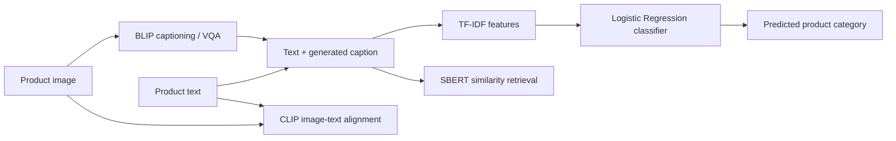

# Multimodal Image and Text Analysis Prototype

A project workflow proof of concept combining product images and text for classification, captioning, visual question answering, and similarity-based retrieval.

> **Scope clarification:** The report proposes an IT hardware inventory and support-ticket use case. The submitted notebook experiments with a fashion-product image/text dataset. The results below describe the notebook experiment; they do not claim that an IT inventory system was implemented.

## Pipeline



## Reported results

| Evaluation | Report value | Context |
|---|---:|---|
| Text classification accuracy | 85.45% | 55 evaluation products across 28 categories |
| BLIP zero-shot VQA semantic accuracy | 50.91% | Exact business labels were harder than generic descriptions |
| Mean CLIP score | 26.32 | Image-text alignment score as reported |
| BLEU / ROUGE-L | 0.0000 / 0.0195 | Low exact wording overlap with reference text |
| SBERT similarity | 0.4655 | Moderate semantic similarity |
| Retrieval Hit Rate @ 5 / MRR | 54.55% / 0.5222 | Similar-product retrieval evaluation |

The report also notes class-level variation: frequent classes such as T-shirts, shirts, and sports shoes performed better, while visually similar categories were more likely to be confused. Metrics come from a small evaluation sample and need larger, stratified validation before any operational use.

## Core competencies

- Multimodal AI combining image and text signals
- Image captioning and visual question answering with BLIP
- Text classification using TF-IDF and Logistic Regression
- Image-text similarity with CLIP
- Semantic similarity and retrieval with Sentence-BERT (SBERT)
- Evaluation with accuracy, BLEU, ROUGE-L, Hit Rate @ 5, and MRR
- Data quality, class imbalance, privacy, and deployment governance considerations

## Tools and libraries

**Python**, **PyTorch**, **Hugging Face Transformers**, **scikit-learn**, **Pandas**, **NumPy**, **Pillow**, **KaggleHub**, **NLTK**, **Evaluate**, **rouge-score**, **Sentence-Transformers**.

## Repository code

`src/multimodal_prototype.py` contains Python cells exported from the project workflow notebook. Configure the dataset path and review model downloads before running. Dataset files and pretrained weights are not included.

## Setup

```bash
python -m pip install -r requirements.txt
```

## Limitations and privacy

Fashion-product data is not a substitute for IT asset imagery or real support tickets. Real tickets may contain personal or security-sensitive information; redact it before processing and define retention and access controls. No dataset, model weights, API keys, access tokens, or personal data are included.
